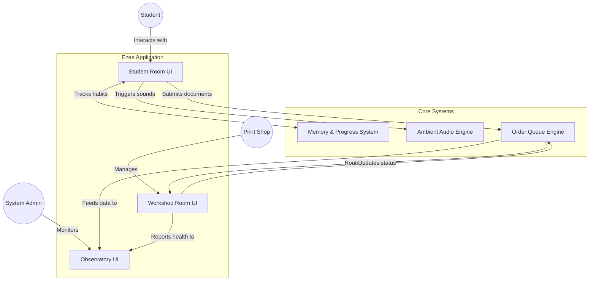

<div align="center">
  
  <h1>Ezee Universe</h1>
  <p><i>A beautifully crafted, highly interactive, and fully responsive printing & academic ecosystem.</i></p>
</div>

---

## 🌌 Overview

**Ezee** is a meticulously designed web application that transforms the mundane task of printing academic documents into an immersive, cozy, and delightful experience. Built with **Next.js** and **Framer Motion**, Ezee eschews generic UI frameworks in favor of handcrafted SVG illustrations, dynamic vanilla CSS animations, and deep, state-driven interactivity.

The platform is split into three distinct universes:
1. **The Student Room** (User Portal)
2. **The Workshop** (Vendor/Print Shop Portal)
3. **The Observatory** (Admin Dashboard)

---

## ✨ Key Features

### 🎓 1. The Student Room (`/student`)
A side-scrolling, beautifully illustrated isometric room where students can manage their academic lives.
- **Print Studio:** Upload, configure, and send documents to local campus print shops.
- **Memory Library & Scrapbook:** A cozy diary that tracks print history, late-night study sessions, and memories.
- **Dynamic Weather System:** Change the ambient weather (Sunny, Rainy, Sunset, Midnight) which affects the lighting and mood of the room.
- **Ezi the Cat:** A hidden interactive easter egg companion that sleeps in different spots around the room based on the time of day.
- **Ambient Audio Engine:** Lofi beats and environmental soundscapes tied directly to the room's current weather.

### 🖨️ 2. The Workshop (`/vendor`)
A focused, utilitarian dashboard for print shop owners.
- **Order Queue Management:** Accept, reject, print, and hand over student documents.
- **Live Settings:** Adjust pricing (B/W, Colour, Binding types), operating hours, and automatic press assignment.
- **Inventory Tracking:** Real-time ink level monitoring and alerts.

### 🔭 3. The Observatory (`/admin`)
A top-level, data-dense control center for platform administrators.
- **System Map:** View all active vendors, their health status, and live revenue generation.
- **Global Audit Logs:** Track system-wide events and transactions in real-time.
- **Incident Management:** Handle high, medium, and low-priority support tickets across the campus network.

---

## 📐 Architecture & Flow



---

## 🛠️ Technology Stack

| Category | Technology |
| :--- | :--- |
| **Framework** | Next.js (App Router) |
| **Language** | TypeScript |
| **Styling** | Vanilla CSS Modules (No Tailwind) |
| **Animation** | Framer Motion & CSS Keyframes |
| **Graphics** | Inline handcrafted SVGs |

---

## 📱 Mobile Responsiveness

Ezee is built to be a **10/10 responsive experience**. 
While the desktop version utilizes a sweeping 300vw side-scrolling camera for the Student Room, the mobile version intelligently reflows the entire interface into a highly ergonomic, vertically stacked `100vw` / `250vh` layout. 
All modals, diaries, and data tables automatically snap to scrollable, single-column flex-grids on devices under `820px`, ensuring no content is ever clipped or squished.

---

## 🚀 Getting Started

### Prerequisites
- Node.js (v18+)
- npm or yarn

### Installation

1. **Clone the repository:**
   ```bash
   git clone https://github.com/Javeria-taj/ezee.git
   cd ezee
   ```

2. **Install dependencies:**
   ```bash
   npm install
   ```

3. **Run the development server:**
   ```bash
   npm run dev
   ```

4. **Explore the Universes:**
   - Student Portal: `http://localhost:3000/student`
   - Vendor Portal: `http://localhost:3000/workshop`
   - Admin Portal: `http://localhost:3000/observatory`

---

## 🎨 Design Philosophy
Ezee is built on the philosophy that utilitarian software (like printing documents) doesn't have to be sterile. By utilizing warm color palettes (`#FAF7F1` paper tones, `#D48A70` terracotta accents), micro-interactions (like the wiggle of a bookmark or the purr of a cat), and immersive soundscapes, Ezee turns a chore into a comforting ritual.

---

<div align="center">
  <i>"Not every moment is a milestone. But they add up." — Ezi's Journal</i>
</div>
